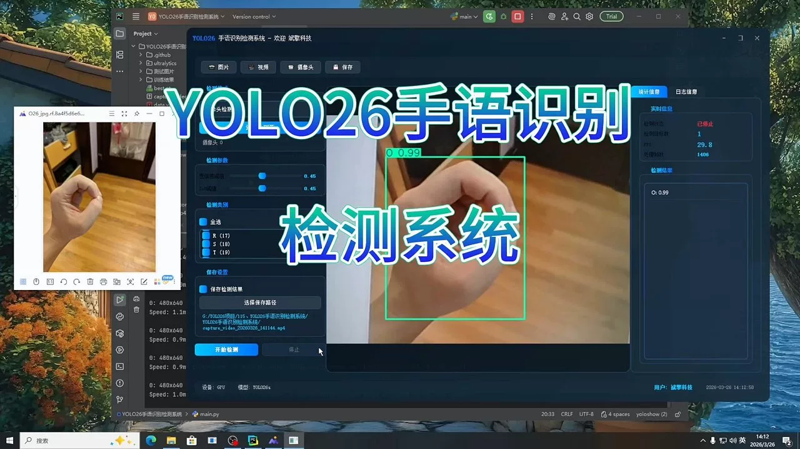
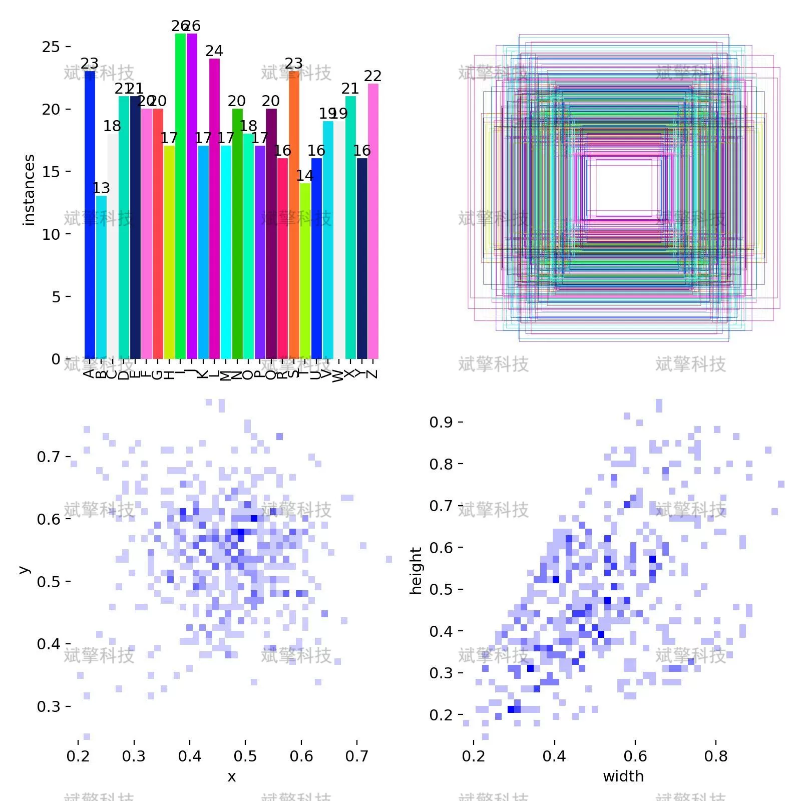
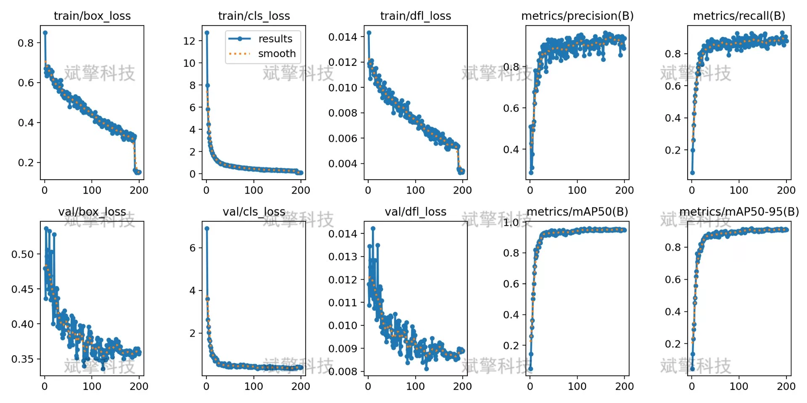
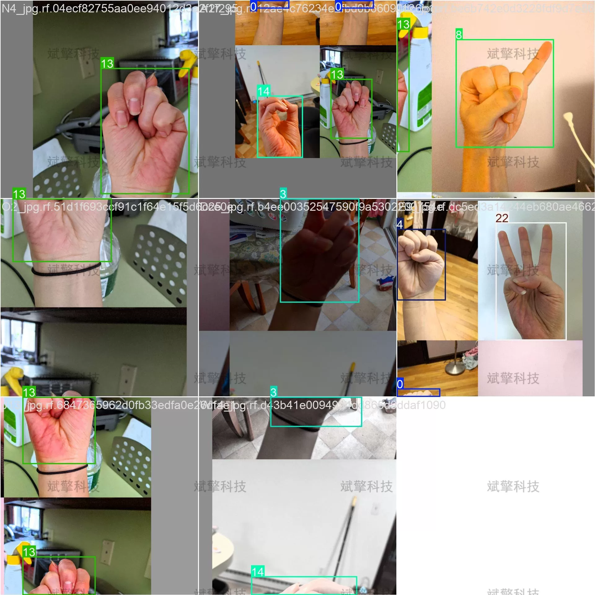
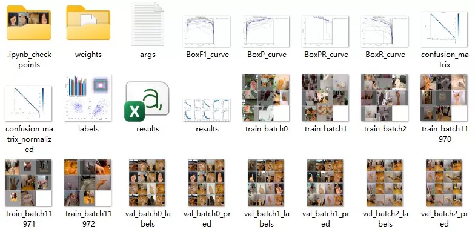
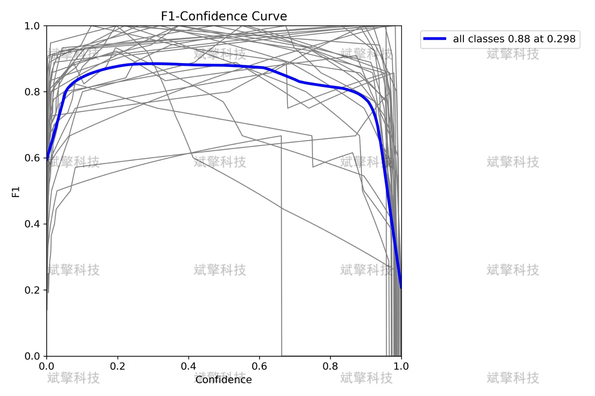
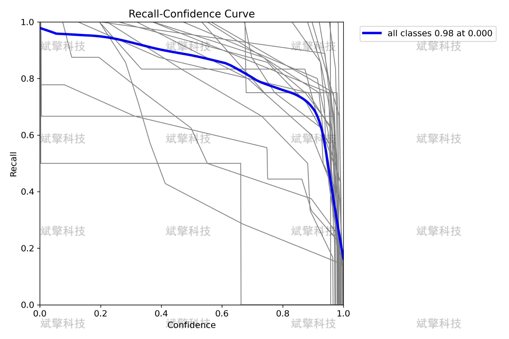
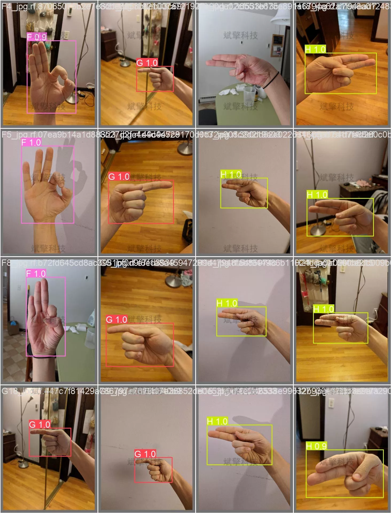

# YOLO26 Sign Language Recognition Detection System | UI Interface

## Body

YOLO26 hand gesture recognition detection system | UI interface based on YOLO26 hand gesture letter detection recognition system (project source code + dataset + model weights + UI interface + python + deep learning + remote environment deployment)

This report is based on the YOLO26 object detection algorithm to build a hand gesture letter recognition system, aiming to achieve real-time detection and recognition of 26 English letters (A-Z) through computer vision technology. The system adopts the YOLO26 architecture, training, validating, and testing on a dataset containing 720 labeled images. Experimental results show that the model performs excellently under relaxed IoU standards, with mAP50 reaching 1.00 and F1-score as high as 0.99, while the recall rate remains at 1.00 until high confidence thresholds. During the training process, the loss function steadily decreases, without obvious overfitting phenomena. This system has practical value under relaxed detection standards, but further optimization of localization accuracy and class balance is needed.

The dataset used in this system contains 720 hand gesture images of the 26 English letters (A-Z), divided into:
Training set: 504 images (70%)
Validation set: 144 images (20%)
Test set: 72 images (10%)

Free reservation for remote installation. Unsuccessful full refund.
Purchase enjoy the following resources (Baidu Drive auto unlock)
   YOLO recognition detection project complete source code
   YOLO format dataset
   Training code + UI interface code
   Trained model + result images
   Software install package
   Add WeChat to reserve remote installation (purchase after automatic display of WeChat ID) - Unsuccessful full refund

⚙️ Core functional modules
Detection capability
    Image detection: upload and detect, return detection box + category information
    Video detection: supports video files, analyzes frames accurately one by one
    Camera real-time detection: connects USB camera, realizes dynamic monitoring
Interaction and control
    Target selection: freely choose one or more categories for detection
    Parameter real-time adjustment: adjustable confidence threshold & IoU threshold, flexibly control precision
    Result saving: image/video/camera detection results saved in one click
System and data
    User login registration: supports password strength detection + encryption storage
    Log recording: automatically records operation and error information (with timestamp)

## Images

## Payment

Here is a pay link on Stripe ( https://buy.stripe.com/3cs8yP7sY87d0vu9AB ). Please contact me lonlonago@foxmail.com after funding $89, and I will send you a complete data files , thank you!

